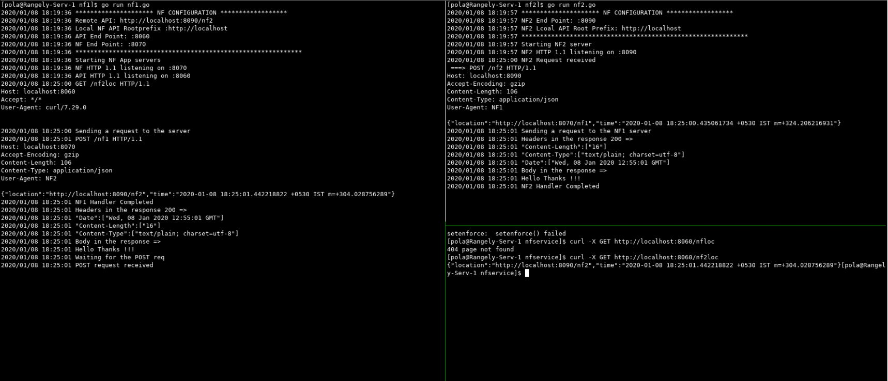

# nfservice
A sample to demonstrate a basic network functions communication.
There are two network functions here NF1 and NF2 which have REST based 
interfaces. NF1 exposes an API to get the url of NF2 api.

Both NF1 and NF2 have an inbuilt http server and http client.
NF1 exposes an a REST API  /nf2loc to get the location of the NF2.
- On query(GET request) from the client to NF1  [client -> GET (http://localhost:8060/nf2loc) -> NF1]
- NF1 sends a POST request to NF2 with the api location of NF1 in the body and 
  the time when the request has been sent  [ NF1 -> POST (http://localhost:8090/) -> NF2 ]
- NF2 on receiving the POST request from NF1, NF2 checks the content of the 
  request, if proper responds with a 200 OK. [ NF2 -> 200 OK(POST) -> NF1 ]
- NF2 sends a POST request to NF1 with the api location of NF2 in the body and
  the time when the request has been sent [ NF2 -> POST (http://localhost:8070) -> NF1]
- NF1 on receiving the POST request from NF2, NF1 checks the content of the 
  request, if proper responds with a 200 OK. [NF1 -> 200 OK(POST) -> NF2 ]
- NF1 responds to the GET request from the client with the location of NF2 and 
  the time when the NF2 had generated the request.[NF1 -> 200 OK(GET) -> client]

## NF1
Configurations of NF1 are as below which is provided in JSON format

remotenfapiroot : API root of the NF2. The NF1 uses the API root to query the
NF2 api location. 
default: http://localhost:8090"

localapirootprefix : API root prefix of the NF1. The NF1 uses the API root prefix
to sends its api location towards NF2. 
default:http://localhost

HTTP Config

apiendpoint : The end point of the NF1 for the API from the client.
default::8060

nfendpoint : The end point of the NF1 server for requests from NF2.
default: :8070

## NF2
Configurations of NF2 are as below which is provided in JSON format

localapirootprefix : API root prefix of the NF2. The NF2 uses the API root prefix
to sends its api location towards NF1. 
default:http://localhost

nfendpoint : The end point of the NF2 server for requests from NF1.
default: :8090

## Screenshot of a successful execution

